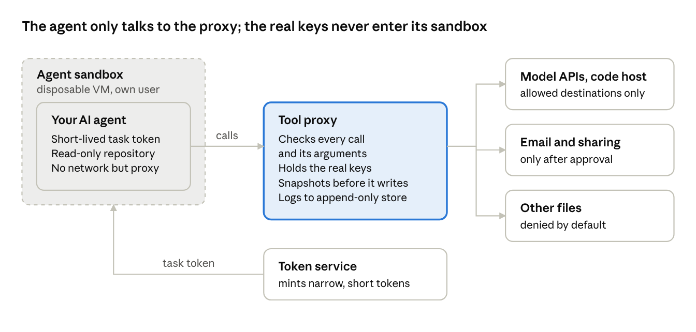
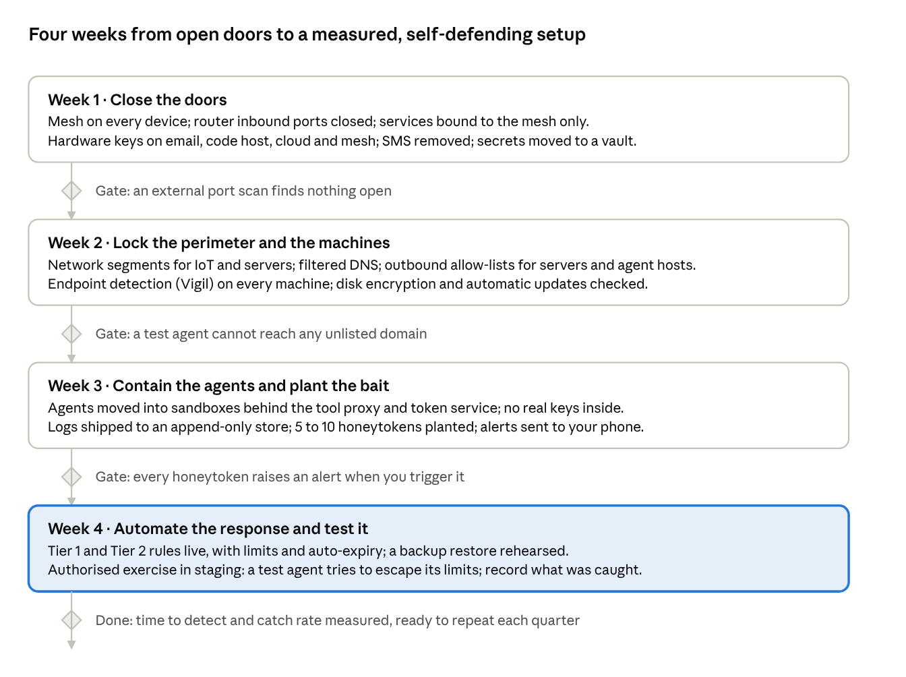

# AI Defence in Depth: Distrust Every Agent

*A practical white paper for homes, labs and small teams* · FinAI Labz (AI Labz Ltd) · Revision 2, 10 October 2026

**[Read the white paper (PDF, 16 pages)](AI-Defence-in-Depth-Distrust-Every-Agent.pdf)**

An AI agent can do no harm until it has access. Every attack, by a hostile agent or by one of your own that has been hijacked or is simply too persistent, starts by gaining a network path, a credential or a tool. The paper's defence: **deny access first, and distrust every agent, including the ones you deploy.**

It sets out seven layers, each assuming the one before it has already failed:

1. **Private network:** every house server and workstation on a private mesh; nothing reachable from the internet.
2. **Perimeter:** router, DNS and outbound traffic locked to what is needed.
3. **Server and workstation:** hardware keys, least privilege, a secrets vault, endpoint detection.
4. **Agent containment:** sandboxes, short-lived narrow tokens that shrink on suspicion, a tool proxy the agent cannot reach that checks every call and its arguments.
5. **Detection and deception:** tamper-evident logs, rules tuned to AI behaviour, honeytokens.
6. **Response while you sleep:** machine-speed containment by fixed rules; contain the source first when no one answers.
7. **Recovery:** backups no agent can alter.

The paper also lists what this design cannot stop, and includes starter templates: a default-deny mesh policy, an agent outbound allow-list, a response policy and a honeytoken checklist.

## What changed in revision 2

| Change | Where | The one-line version |
| --- | --- | --- |
| Check the arguments, not just the tool | Layer 4 | List what is allowed. A blocked pattern comes back slightly changed. |
| Watch what leaves | Layer 4, Appendix C | Bait that turns up in an outgoing message is proof, not suspicion. |
| Approve on another device | Layer 4 | An agent that can use your screen can click your Approve button. |
| Narrow before you kill | Layers 4 and 6 | Suspicion costs the agent its power, not its task. |
| Snapshot before writing | Layer 4 | Every allowed change can be undone. What cannot be undone needs approval. |
| One 3 a.m. rule, not two | Layer 6 | One unanswered alert contains its source. Containing everything needs two detectors. |

Four corrections came with it: the executive summary now points the tool at Layer 5 and says "tamper-evident", Appendix A's text matches its rules, Appendix B's allow-list no longer includes the code host, and Appendix C parses as YAML.

This repository's `awd` tool is the first piece of layer 5 for your own workstation: a transparent, tamper-evident record of what AI agents do.
